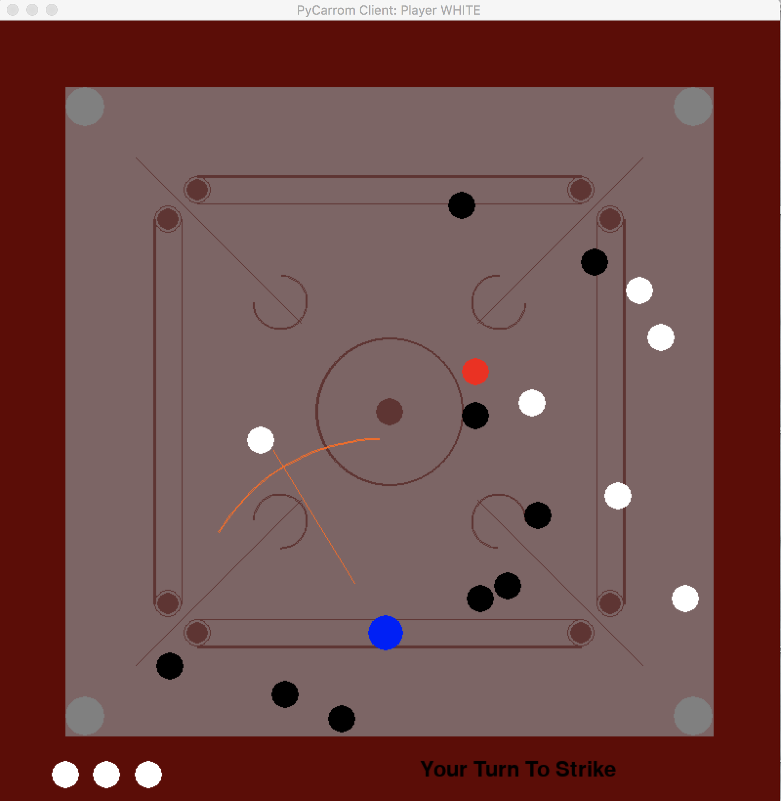

# PyCarrom
Python based 2 player carrom game application which can be player across network or on the same machine.
For detailed documentation refer the code.

To play locally run the guigame.py. 

To play remotely run the carrom_server.py to launch the server. 
Run the carrom_client.py to create the clients which will launch the GUI and accept user input.

### How To Play
    Press 'A' or 'D' to move the striker left or right respectively.
    Press 'W' or 'S' to increase or decrease the striker speed.
    Press 'Q' or 'E' to control striker striking angle.
    Press 'SPACE' to strike.
    Press 'R' to rotate the carrom men (only first strike).
    Press 'SHIFT' with above keys for fine grain control.

### Rules
    Pocketing the striker will result in penalty.
    Conquering queen requires a follow if no player carrom men was pocketed along with it.
    Pocketing player carrom men will keep the player turn.
    Penalty will result in all the player carrom men pocketed 
    in the current turn to be returned and change in player turn.
    Pocketing last of opponents or players carrom men without pocketing queen will result in penalty.
    Player who pockets all of player's carrom men wins (after queen is conquered).

### Requirements
*  python3
*  pygame
*  tkinter (for networked game)

### Design 
#### coin.py
Defines the carrom men, the queen and the striker and handles the simulation physics.
#### board.py
Defines the carrom board, the layout.
#### carrom.py
Uses the functionality from _coin.py_ and _board.py_ to create a 
functional carrom game with its set of defined rules.

#### guigame.py
Creates a GUI wrapper around carrom.py to play locally.

#### carrom_server.py
Launches a carrom game server, to which clients connects, and handles simulations.

#### carrom_client.py 
Connects to the carrom game server, creates GUI and accepts user input.